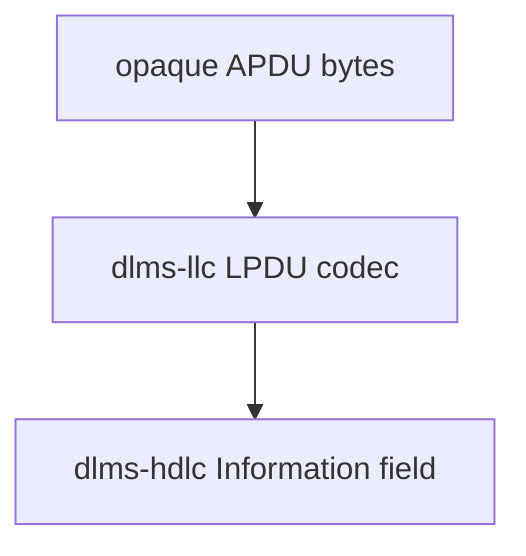
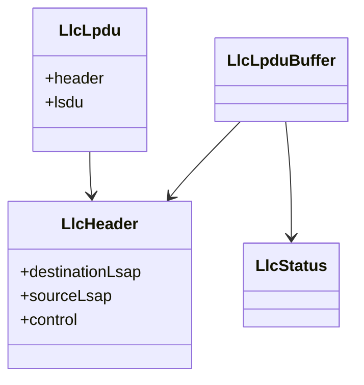

# LLC Architecture

## 1. Scope

`dlms-llc` implements the DLMS/COSEM LLC sub-layer codec used by the
3-layer, connection-oriented HDLC-based communication profile.

The library adds or removes the 3-byte LLC header and preserves APDU bytes
exactly.

## 2. In Scope

- LLC header encode/decode.
- LPDU encode/decode.
- DLMS client request helper.
- DLMS server response helper.
- Destination LSAP broadcast decode policy.
- C ABI wrapper.

## 3. Out of Scope

- HDLC frame encoding.
- HDLC segmentation/reassembly.
- APDU parsing.
- Wrapper profile.
- Transport I/O.
- Security and ciphering.

## 4. Dependencies

```text
dlms-llc
  -> C++ standard library
```

`dlms-llc` must not depend on HDLC, Wrapper, APDU, profile, transport, or
association layers.

## 5. Layer Diagram



## 6. Class Interaction Diagram



## 7. State Machine

This repository has no protocol state machine. It is a stateless codec.

## 8. Error Model

Public runtime APIs return `LlcStatus`. They validate headers, buffer sizes,
and decode policy without throwing exceptions.

## 9. Test Strategy

Unit tests cover header validation, LPDU encode/decode, known DLMS request and
response vectors, broadcast policy, C ABI, and C header compilation. Root
integration tests verify LLC payload preservation across HDLC boundaries.
